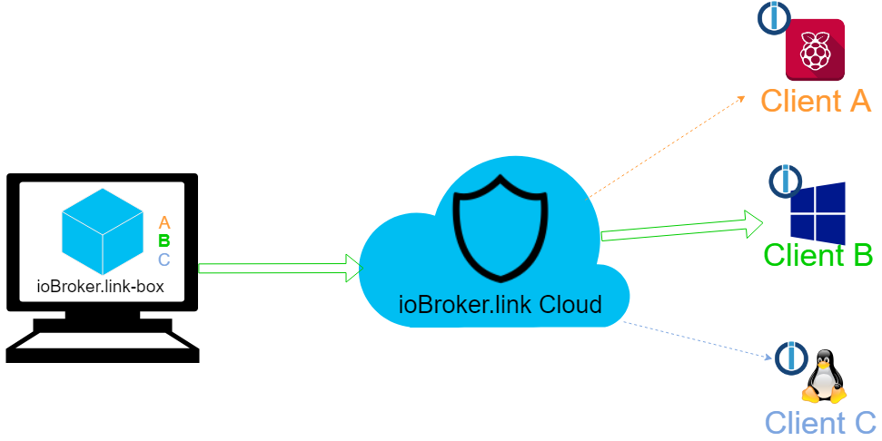
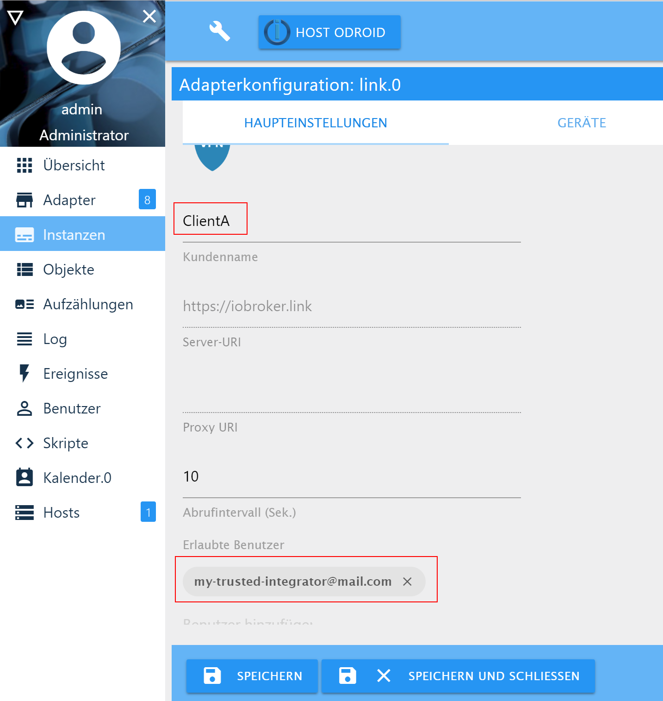
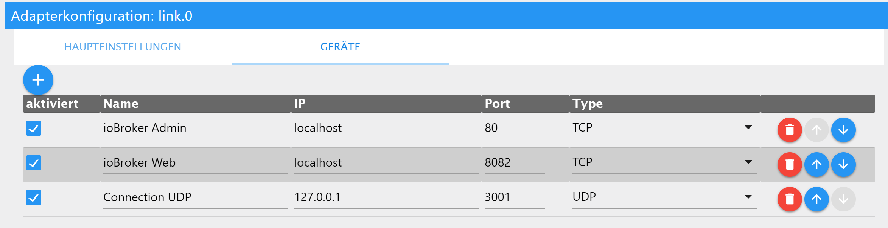

# ioBroker.link-box
=====================

This is a client software to use it together with iobroker.link cloud.

ioBroker.link solution consist of 3 parts:
- ioBroker.link-box - client. Is installed on your Windows or Linux PC
- ioBroker.link-server - VPN cloud. Is always available under https://iobroker.link
- [ioBroker.link](https://www.npmjs.com/package/iobroker.link) - ioBroker adapter, that must be installed in the ioBroker instance

The integrator can access one of his clients via ioBroker.link.

## Install
You require the node.js Version >=6.

To install ioBroker.link-box on your system just navigate to some directory,
e.g. /opt/box or C:\ioBroker.link-box and write:

`npm install iobroker.link-box`

After the package is installed you can write `node box.js` and open link `http://localhost:4000` in browser.

For access the iobroker.link server you need a iobroker.pro account, which can be registered here [https://iobroker.pro](https://iobroker.pro).

## Configuration

The client must allow access to the integrator in ioBroker.link adapter.

The integrator or client itself must configure all TCP/UDP connections before the communication established.

Every required connection must be preconfigured in the adapter settings to avoid unauthorized access.

